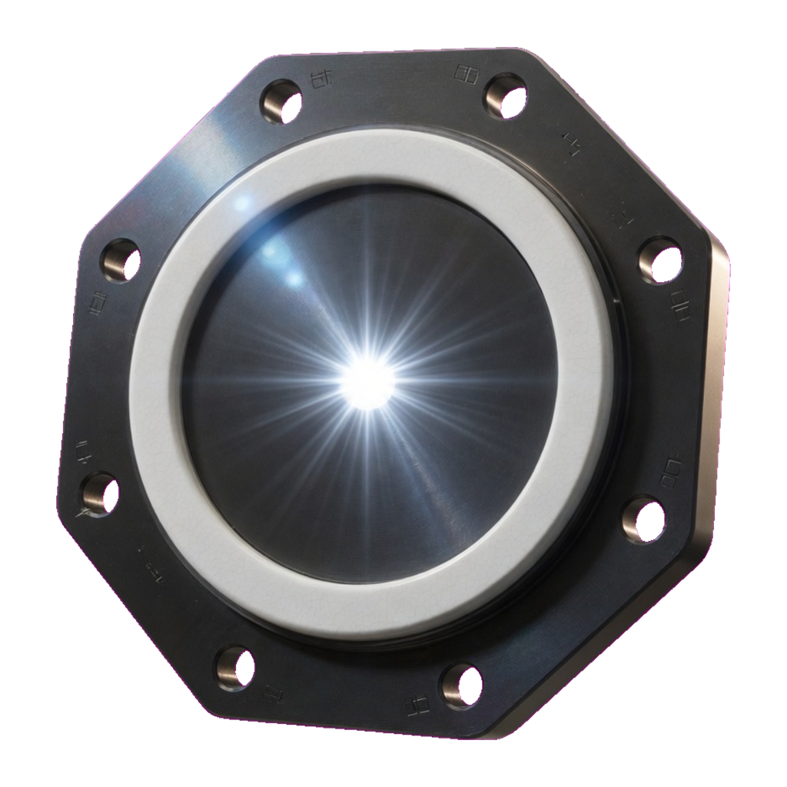
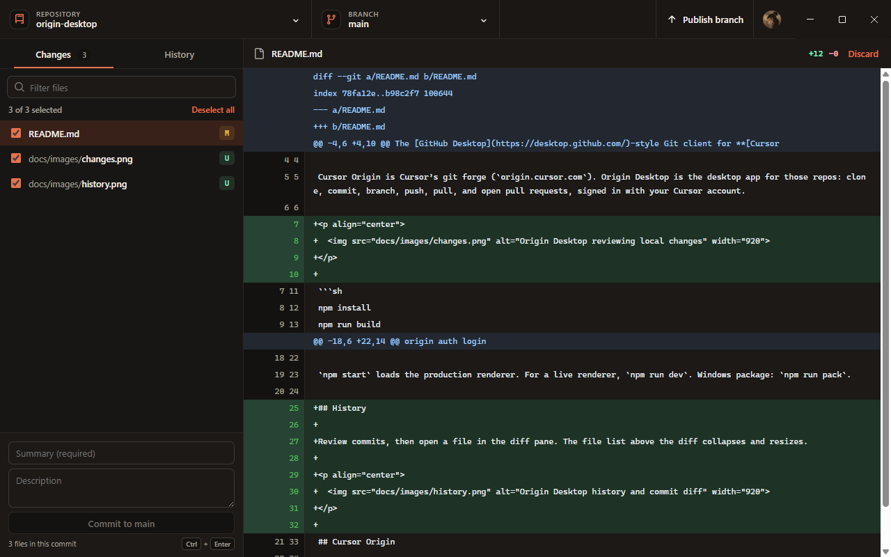
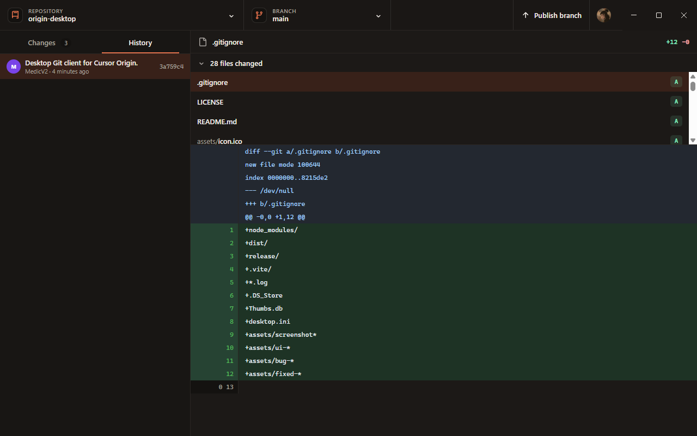

<p align="center">
  
</p>

# Origin Desktop

The [GitHub Desktop](https://desktop.github.com/)-style Git client for **[Cursor Origin](https://cursor.com/docs/origin)**.

Cursor Origin is Cursor’s git forge (`origin.cursor.com`). Origin Desktop is the desktop app for those repos: clone, commit, branch, push, pull, and open pull requests, signed in with your Cursor account.

<p align="center">
  
</p>

```sh
npm install
npm run build
npm start
```

Sign in with the Origin CLI first:

```sh
origin auth login
```

`npm start` loads the production renderer. For a live renderer, `npm run dev`. Windows package: `npm run pack`.

## History

Review commits, then open a file in the diff pane. The file list above the diff collapses and resizes.

<p align="center">
  
</p>

## Cursor Origin

| | |
| --- | --- |
| Product | [Cursor Origin](https://cursor.com/changelog/origin-code-hosting) |
| Git remote | `https://origin.cursor.com/{owner}/{repo}.git` |
| Browse | `https://cursor.com/codebase/{owner}/{repo}` |
| CLI | `origin` (`https://cursor.com/docs/origin/cli`) |

This does not replace GitHub Desktop. It is the Origin client for Cursor repos.

## Layout

See [docs/architecture.md](docs/architecture.md). Electron owns processes and Git/Origin. The renderer owns screens. `src/display.js` formats facts; it does not talk to Git.
